Edutracker a website that integrates authority and teachers to ensure best quality
education for the student. In this website the authority can upload and update the
academic calendar , class routine and add teachers, and also can track every class that the
teachers take.
Teachers can track classes taken by him/her to provide the best quality education for the
student.

Installation process: Make sure you have installed nodejs and mongodb on your computer.
copy the project file in you machine. and open it in the correct directory.

Installing dependencies: you to init Node Package Mange first 
while you are in the root directory of the project open the vs code terminal and write the command "npm init -y"
then write the command "npm install express express-session mongoose hbs body-parser connect-mongo dotenv moment-timezone morgan multer node-cron nodemon"
After that to start the server write the command "npm start"

User interface
 
Login page:
 
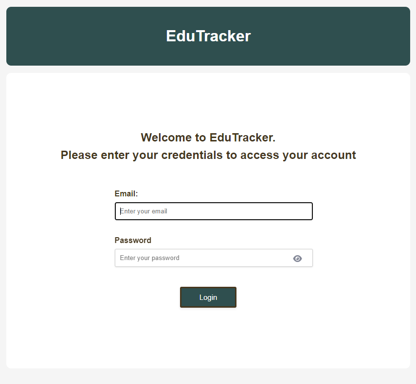
 
Administrative panel:
 
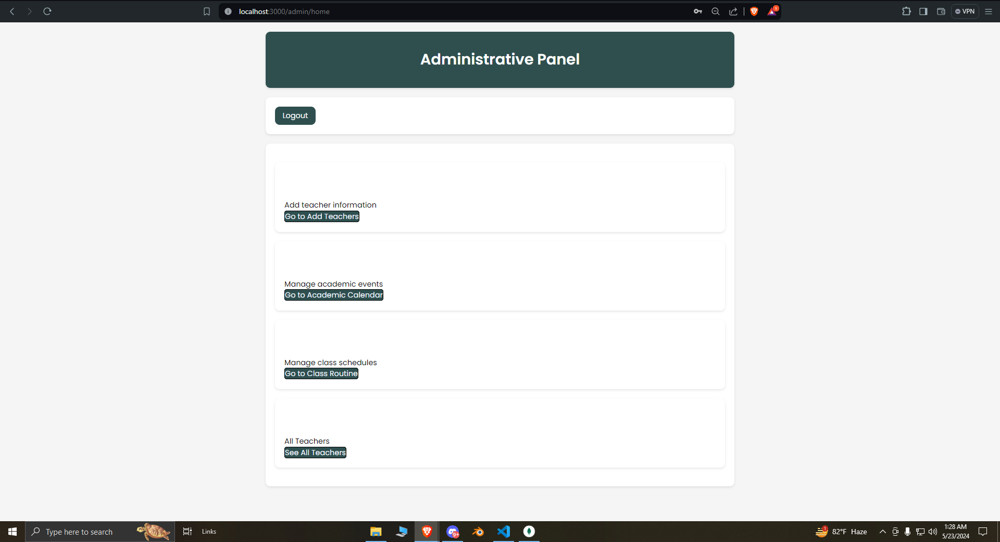
 
Academic Calender:
 
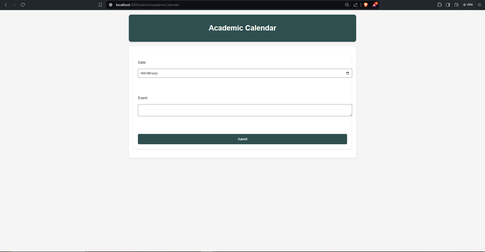
 
Add Teacher:
 
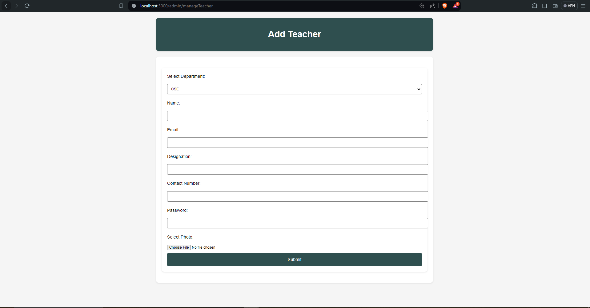
 
Routine Management:
 
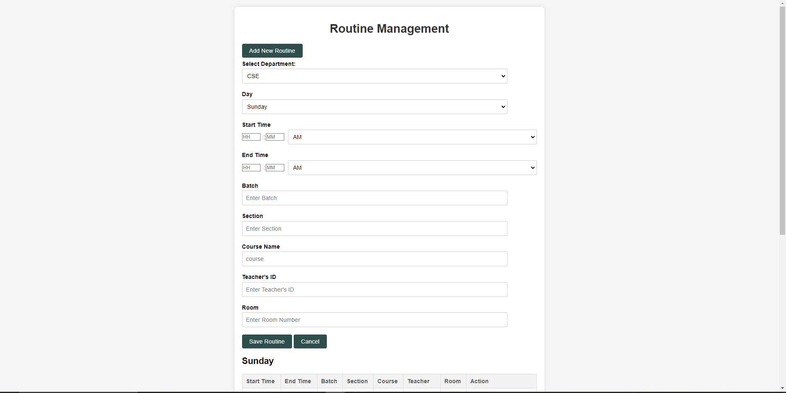
 
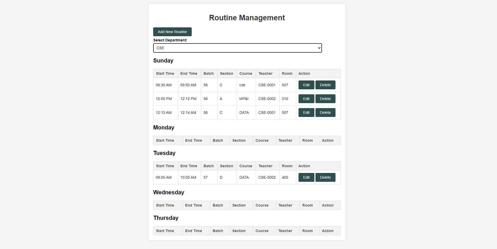
 
All Teacher:
 
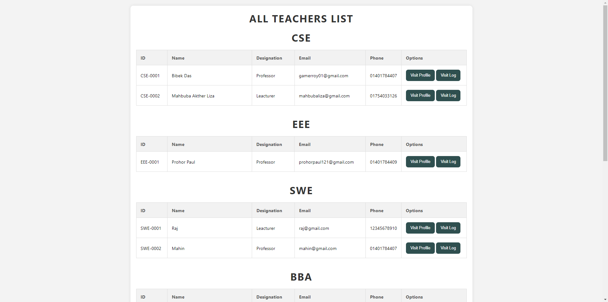
 
Teacher Profile:
 
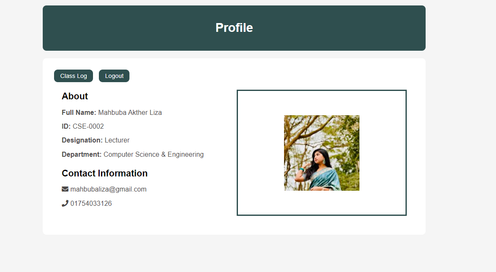
 
Class-Log:
 
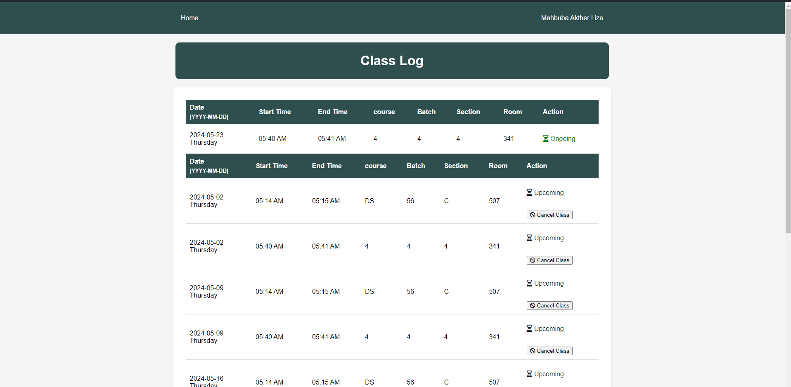
 
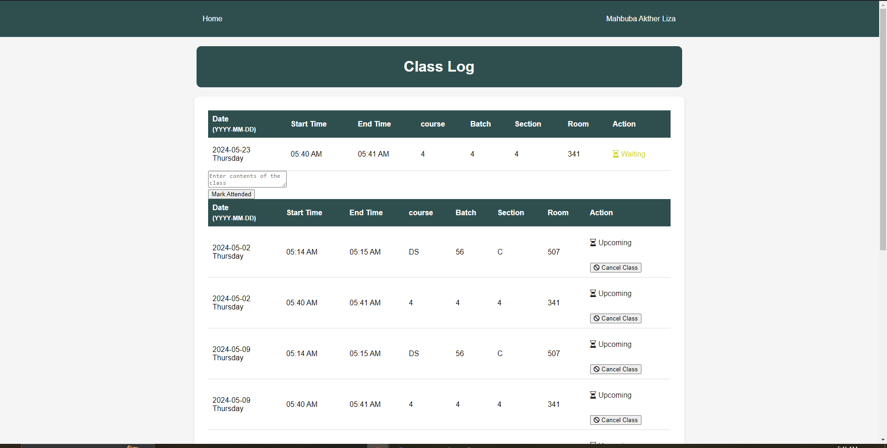
 
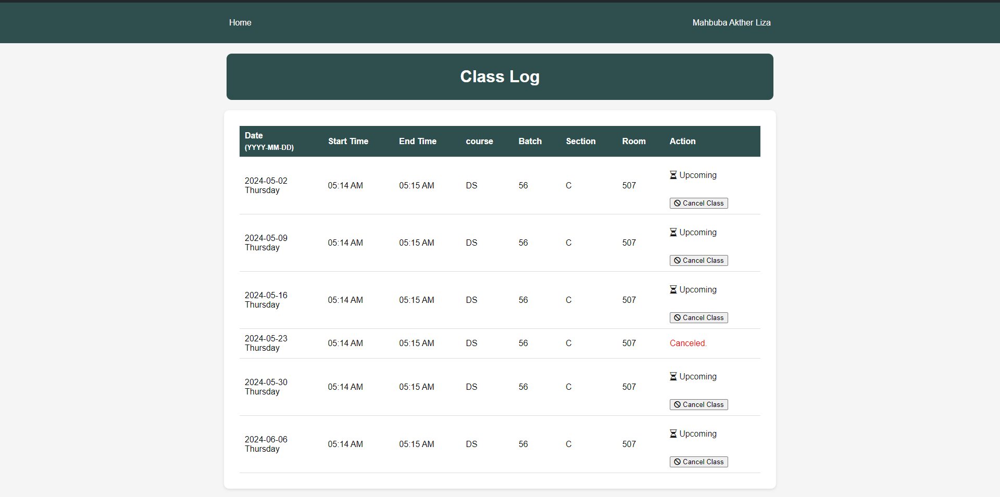
 
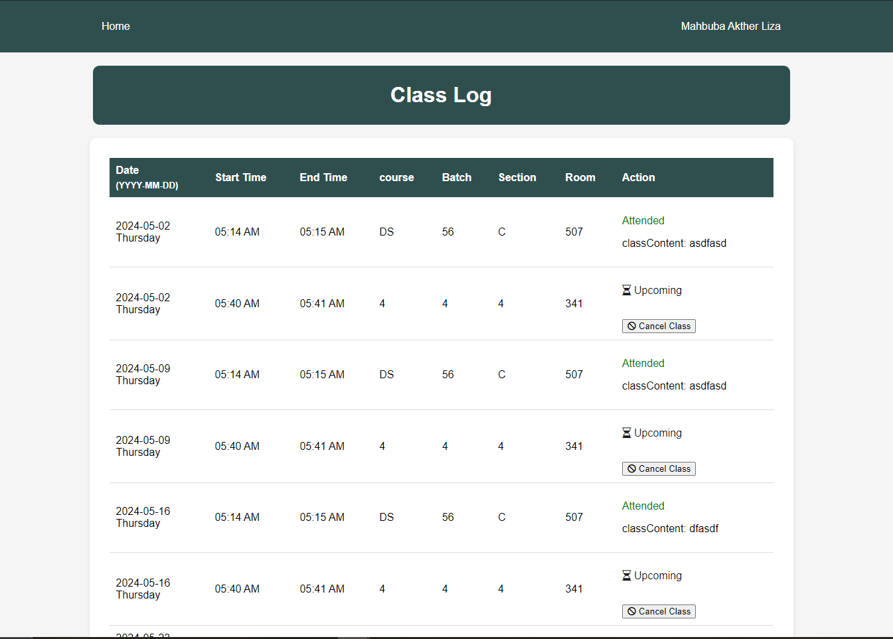
 
